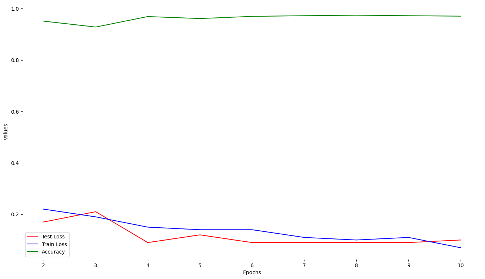
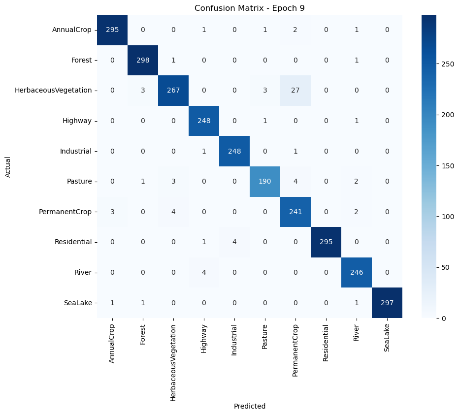
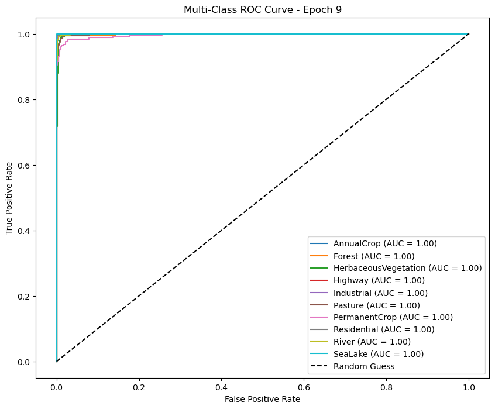

# 🏞️ EuroSAT Land Cover Imagery Classification

A deep learning model for **multi-class image classification** using PyTorch. This project classifies satellite images into **10 land cover categories**, including crops, forests, highways, water bodies, and more.

## 📊 Model performance

Accuracy -- **97.41%**





## 📂 [Dataset](https://www.kaggle.com/datasets/apollo2506/eurosat-dataset)

The dataset consists of images categorized into the following 10 classes:

- **AnnualCrop**
- **Forest**
- **HerbaceousVegetation**
- **Highway**
- **Industrial**
- **Pasture**
- **PermanentCrop**
- **Residential**
- **River**
- **SeaLake**

## 🛠️ Installation (For personal use as framework for projects / transfer learning)

Download the [Dataset](https://www.kaggle.com/datasets/apollo2506/eurosat-dataset)
Clone the repository:
 ```bash
 git clone https://github.com/aquastones/EuroSAT-Imagery-Classifier.git
 cd EuroSAT-Imagery-Classifier
 ```

## 🚀 Usage

- Use data_splitter.ipynb to split the data into train/test/validation folders according to the .csv file in the dataset folder.
- Add all of the items from validation to the test folder to get a 70/30 ratio (optional)
- Make sure to have all the correct paths in the training notebook
- You're ready to train! After the training is finished plotting the results graphs is available in the respective notebooks
- If you are using a different dataset make sure to calculate the mean and std values using normalization_calculator.ipynb

  To classify a single image:
  ```bash
  python predict.py --image_path path/to/image.jpg --model_path models/best_model.pth
  ```

## 🏗️ Model Architecture

The model is built using **PyTorch** with a **CNN-based architecture**, fine-tuned from a *DenseNet-169* model.

## 🤝 Contributing

Contributions are welcome! Feel free to open issues or submit pull requests.

## 📜 License

This project is licensed under the **MIT License**.
